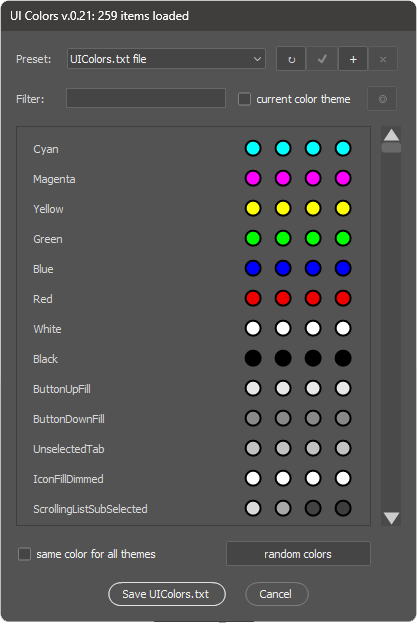
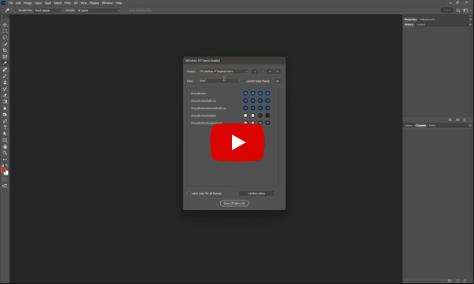

# UI colors

Photoshop stores information about the color schemes of the interface in the `Required\UIcolors.jsx` file.The script is designed to present colors from this file, as well as a quick search for elements and modifying colors.

## how to install

Unfortunately, the script does not support the automatic installation from the Creative Cloud application, so you need to perform the following steps:
1. Download the latest version of [UIcolors.jsx](https://github.com/boogalooper/UIcolors/blob/master/UIcolors.jsx) from the GitHub repository [https://github.com/boogalooper/UIcolors](https://github.com/boogalooper/UIcolors)
2. Copy the Uicolors.jsx file in the `Pressets\Scripts\` Photoshop folder
3. Restart Photoshop if it was launched at the time of copying the script. `Ui colors` will appear on the `File -> Scripts` menu
4. Run the script from the menu

## Application of UI Colors

After the first launch, `UI Colors` will offer you to create a preset with a backup copy of the source file - this is the recommended operation, it will allow you to return to the original colors. Also, using the presets panel, you can save color schemes and use them to transfer between computers. Using the `Load from File option ...` you can download data on colors from a text file (the data structure must correspond to the format of the original file `uicolors.txt`)

The `Filter` text field is designed to search for control elements either by name or by color value in HEX format. The `Current Color Theme` filter hides all colors except colors of active color scheme in Photoshop.

The `eyedropper tool` button (indicated by `◎` icon) allows you to use the Photoshop eyedropper to get a sample of the color of any control - when it is pressed, the script will restart in the palette mode and you can use the eyedropper to take the color sample (for this you need to push the left buttonmice and holding it move around the screen). After confirming the color sample, the script will restart and the value found in the search field will be indicated.

After the control element you need is found, you can manually change its color - for this, just click on a circle with color in the corresponding field.Each control element is described by 4 colors - from the brightest theme to the darkest.You can change them all, or only in an active topic.

The `same color for all themes` option is designed to quickly change the color of the element in all color elements at the same time. The `Random Colors` button modifies the colors of all controls (taking into account the installed filters) randomly - it can be useful for finding an element by color (if you cannot find it in another way).

The script stores all the settings (including presets) in the file:
WINDOWS: `~User\AppData\Roaming\Adobe\Adobe Photoshop (your version number)\Adobe Photoshop 2020 Settings\UIColors.desc'`,
MACOS: `~Library/Preferences/Adobe Photoshop (your version number) Settings/UIColors.desc`
If you need to save or transfer the UI Colors settings, just copy this file to a similar folder on another computer.

## Replacing original UIColors.txt

The process of updating the source file `UIColors.txt` is exhausted for Windows and MacOS.

### Windows:

* Photoshop is launched by administrator - in this case, to rewrite the original `UIColors.txt` simply push the` Save uicolors.txt` button
* Photoshop launched by user - using the `Save UIColors.txt` button, you need to save the `UIColors.txt` file to any available folder, and then manually move it to the `c:\Program Files\Adobe Photoshop folder.Your Version Number)\Required\`, confirming that the file will be overwritten

### MacOs:
Go to the menu `Programs` -> `Photoshop`, open context menu and select `Show Package Contents`, then copy the file in `/Contents/Required`

## Compatibility:

The script is tested on Photoshop CC2014 and newer.

## Video Example:

