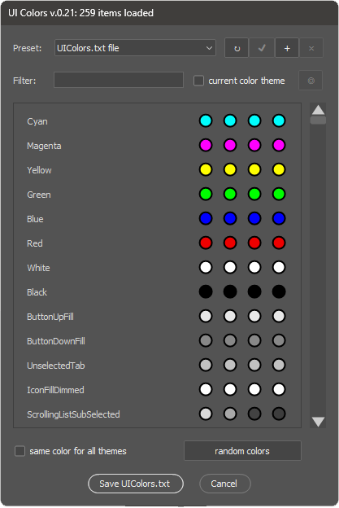

# UI colors

Photoshop хранит информацию о цветовых схемах интерфейса в файле `Required\UIcolors.jsx`. Скрипт предназначен для графического представления цветов из этого файла, а также быстрого поиска элементов и модификации цветов.

## Как установить

К сожалению, скрипт не поддерживает автоматическую установку из приложения Creative Cloud, поэтому вам необходимо выполнить следующие шаги:

1. Скачайте последнюю версию [UIcolors.jsx](https://github.com/boogalooper/UIcolors/blob/master/UIcolors.jsx) из репозитория GitHub [https://github.com/boogalooper/UIcolors](https://github.com/boogalooper/UIcolors)
2. Скопируйте файл UIcolors.jsx в папку `Presets\Scripts\` Photoshop
3. Перезапустите Photoshop, если он был запущен в момент копирования скрипта. `UI colors` появится в меню `File -> Scripts`
4. Запустите скрипт из меню

## Возможности UI colors

После первого запуска `UI colors` предложит вам создать пресет с резервной копией исходного файла - это рекомендованная операция, она позволит вам вернуться к исходным цветам. Также с помощью панели пресетов вы можете сохранять цветовые схемы и использовать их для переноса между компьютерами. С помощью опции `load from file...` вы можете загрузить данные о цветах из текстового файла (структура данных должна соответствовать формату оригинального файла `UIcolors.txt`)

Текстовое поле `Filter` предназначено для поиска элементов управления либо по названию, либо по цветовому значению в формате HEX. Фильтр `current color theme` скрывает все цвета, кроме используемых в цветовой схеме установленной в Photoshop в данный момент.

Кнопка `eyedropper tool` (обозначена значком `◎`) позволяет вам использовать цветовую пипетку Photoshop для получения образца цвета любого элемента управления - при ее нажатии скрипт запустится в режиме палитры и вы сможете использовать пипетку для взятия образца цвета (для этого необходимо зажать левую кнопку мыши и не отпуская ее перемещать по экрану). После подтверждения образца цвета скрипт перезапустится и в поле поиска будет указано найденное HEX значение.

После того, как найден нужный вам элемент управления, вы можете вручную изменить его цвет - для этого достаточно щелкнуть по кружочку с цветом в соответствующем поле. Каждый элемент управления описан 4 цветами - от самой светлой темы до самой тёмной. Вы можете изменить их все, либо только в активной теме.

Опция `same color for all themes` предназначена для быстрого изменения цвета элемента во всех цветовых темах одновременно. Кнопка `random colors` модифицирует цвета всех элементов управления (с учетом установленных фильтров) случайным образом - она может быть полезна для поиска элемента по цвету (в случае, если вы не можете найти его иным образом).

Скрипт хранит все настройки (включая пресеты) в файле:
WINDOWS: `~User\AppData\Roaming\Adobe\Adobe Photoshop (your version number)\Adobe Photoshop 2020 Settings\UIColors.desc'`,
MACOS: `~Library/Preferences/Adobe Photoshop (your version number) Settings/UIColors.desc`
Если вам нужно сохранить или перенести настройки UI colors - просто скопируйте этот файл в аналогичный каталог на другом компьютере.

## Обновление UIColors.txt

Процедура обновления исходного файла `UIColors.txt`отличается для Windows и MacOs.

### Windows:

* Photoshop запущен от имени администратора - в этом случае для перезаписи оригинального `UIColors.txt`достаточно нажать на кнопку `Save UIColors.txt`
* Photoshop запущен от имени пользователя - с помощью кнопки `Save UIColors.txt` необходимо сохранить файл `UIColors.txt` в любое доступное место на диске, а затем вручную перенести его в папку `c:\Program Files\Adobe\Adobe Photoshop (your version number)\Required\`, подтвердив повышение прав пользователя для перезаписи

### MacOs:
перейдите в меню `Programs` -> `Photoshop`, откройте контекстное меню и выберите `Show Package Contents`, затем скопиуруйте файл в `/Contents/Required`

## Совместимость:

Скрипт протестирован на Photoshop CC2014 и новее.

## Видео пример:

